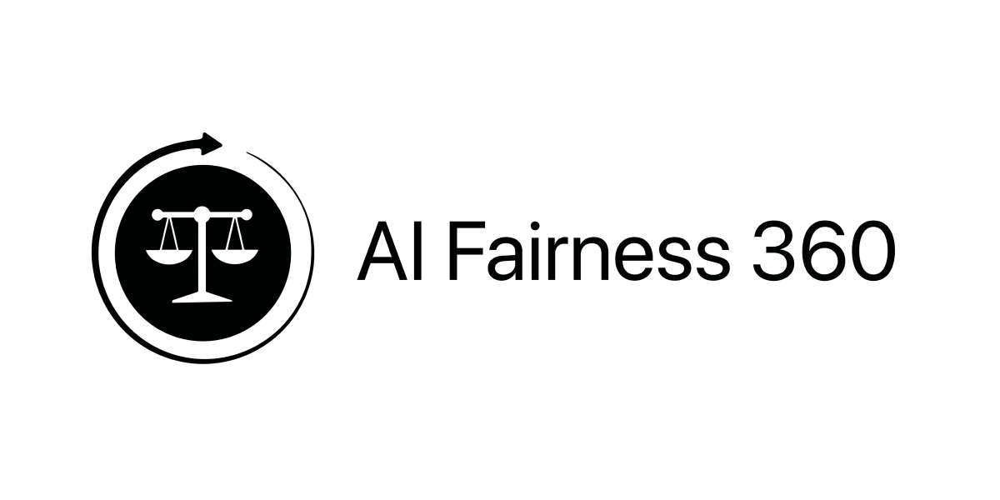
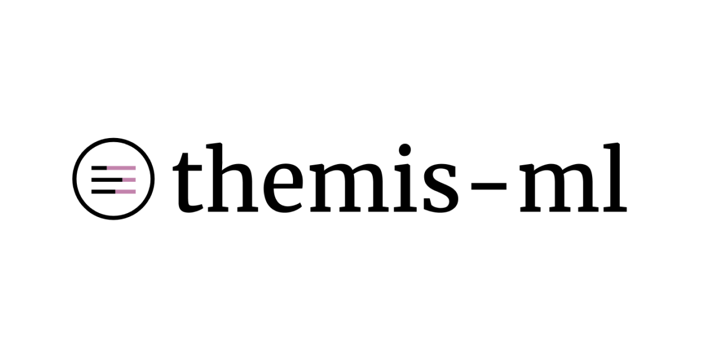

# Fairlearn

Developed by ITU, Fairlearn is an open-source toolkit designed to examine, report, and mitigate discrimination and bias in machine learning models. It leverages leading fairness tools, including AIF360, Themis-ML, and Aequitas, to perform comprehensive bias audits and fairness assessments. Fairlearn enables developers, analysts, and policymakers to make informed decisions by providing performance comparisons and mitigation strategies, ensuring equitable and unbiased AI applications. We invite you to use and contribute to the improvement of Fairlearn.

## Fairness Tools



### AIF360
A toolkit for measuring and mitigating bias in machine learning models, providing algorithms for fairness pre-processing, in-processing, and post-processing.



### Themis-ML
A library focused on bias detection and mitigation in machine learning models, offering tools to identify and correct biases.


### Aequitas
A tool for identifying and analyzing bias and fairness in decision-making processes, helping to ensure equitable outcomes across groups.


### RSFair
A tool that uses representative sampling to evaluate and improve the fairness performance of machine learning models by detecting and correcting discriminatory inputs.

## Datasets Implemented

### German Credit
This dataset classifies people described by a set of attributes as good or bad credit risks. It comes in two formats (one all numeric) and includes a cost matrix.
[Detail](https://archive.ics.uci.edu/ml/datasets/statlog+(german+credit+data))

### Adult Census - To be added soon
Predict whether income exceeds $50K/yr based on census data. Also known as the "Census Income" dataset.
[Detail](https://archive.ics.uci.edu/ml/datasets/adult)

### Taiwan Credit Default - To be added soon
This research focuses on the case of customers' default payments in Taiwan and compares the predictive accuracy of the probability of default among six data mining methods.
[Detail](https://archive.ics.uci.edu/ml/datasets/default+of+credit+card+clients)

## Preprocessing Methods

- [ ] Label Flipping (Aequitas)
- [ ] Disparate Impact Remover (AIF360)
- [ ] Data Repairer (Aequitas)
- [ ] Reweighing (AIF360)
- [ ] Prevalence Sampling (Aequitas)
- [ ] Relabeller (Themis-ML)
- [ ] Representative Sampling (RSFair)

- Optimized Preprocessing (AIF360)
- Learning Fair Representations (AIF360)
- Correlation Suppression (Aequitas)
- Feature Importance Suppression (Aequitas)
- Massaging (Aequitas)

## In-Processing Methods

To be added soon

## Post-Processing Methods

To be added soon

## Datasets Implemented

## Models Implemented

- Logistic Regression (LR)
- Random Forest (RF)
- Support Vector Machine (SVM)
- Gradient Boosting Machines (GBM)

## Getting Started

Follow these steps to set up the project locally:

### Prerequisites

Make sure you have Python 3 installed on your system. You can download it from [python.org](https://www.python.org/downloads/).

### Installation

1. Clone the repository:

    ```bash
    git clone https://github.com/yourusername/fairlearn.git
    cd fairlearn
    ```

2. Create a virtual environment and activate it:

    ```bash
    python3 -m venv venv
    source venv/bin/activate
    ```

3. Install the required packages:

    ```bash
    pip install flask pandas numpy scikit-learn matplotlib seaborn xgboost aif360
    ```

4. Run the application:

    ```bash
    python app.py
    ```

## Usage

1. **Data Selection**: Choose from provided datasets to explore bias checking and mitigation.
2. **Model Selection**: Choose a machine learning model to see its performance and fairness comparison.
3. **Parameter Selection**: Adjust parameters such as test size, random state, and privileged groups.
4. **Results**: View the performance metrics and fairness evaluation of the selected model with the chosen parameters.

## Evaluation Criteria

- **Balanced Accuracy**: The average accuracy obtained on either class.  

- **Theil Index**: Measures inequality in predictions.  

- **Average Odds Difference**: The difference in true positive rates (TPR) and false positive rates (FPR) between groups.  

- **Equal Opportunity Difference**: The difference in true positive rates between groups.  

- **Statistical Parity Difference**: The difference in positive outcome rates between groups.  

- **Disparate Impact**: The ratio of positive outcome rates between groups.  

- **AUC-ROC**: Area Under the Receiver Operating Characteristic Curve, measuring the model's ability to distinguish between classes.  

## License

This project is licensed under the MIT License - see the [LICENSE](LICENSE) file for details.

## Contributing

We welcome contributions to Fairlearn! Please see our [CONTRIBUTING](CONTRIBUTING.md) guidelines for more information.

## Acknowledgements

Developed by ITU. Special thanks to the contributors of AIF360, Themis-ML, and Aequitas for their foundational work in fairness and bias detection in machine learning.


